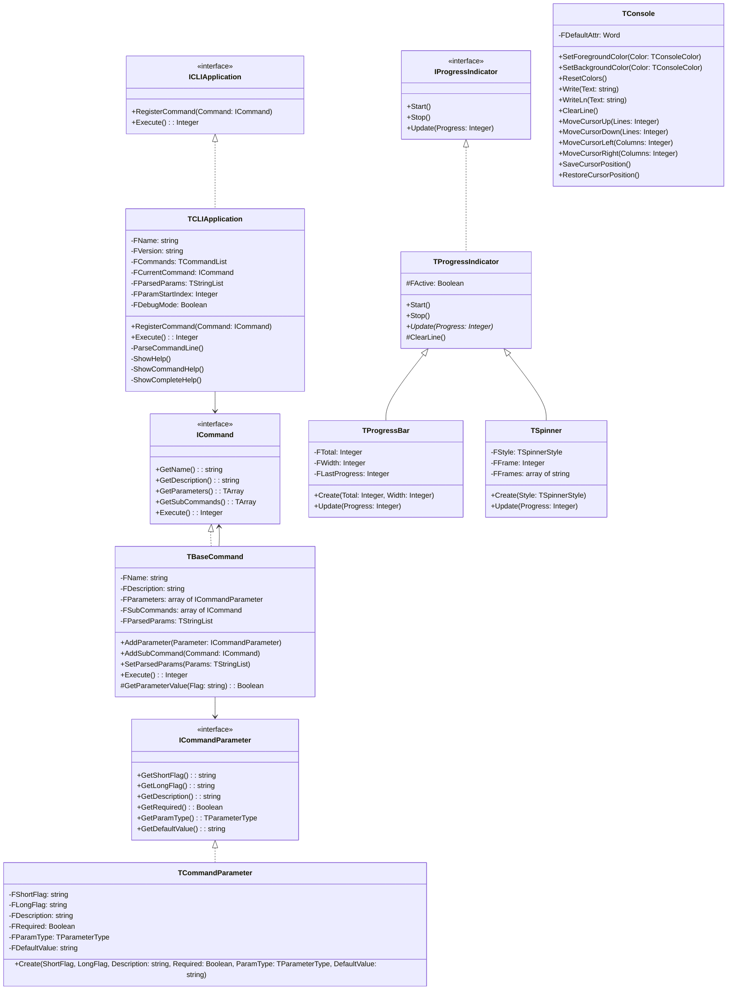

# CLI Framework Technical Documentation

## Architecture Overview

The Free Pascal CLI Framework is built on a modular, interface-based architecture that promotes extensibility and maintainability. The framework is organized into several key components that work together to provide a complete CLI solution.




## Core Components

### 1. Interfaces (`CLI.Interfaces`)

#### `ICommand`
```pascal
ICommand = interface
  function GetName: string;
  function GetDescription: string;
  function GetParameters: specialize TArray<ICommandParameter>;
  function GetSubCommands: specialize TArray<ICommand>;
  function Execute: Integer;
  property Name: string read GetName;
  property Description: string read GetDescription;
  property Parameters: specialize TArray<ICommandParameter> read GetParameters;
  property SubCommands: specialize TArray<ICommand> read GetSubCommands;
end;
```

#### `ICommandParameter`
```pascal
ICommandParameter = interface
  function GetShortFlag: string;
  function GetLongFlag: string;
  function GetDescription: string;
  function GetRequired: Boolean;
  function GetParamType: TParameterType;
  function GetDefaultValue: string;
  property ShortFlag: string read GetShortFlag;
  property LongFlag: string read GetLongFlag;
  property Description: string read GetDescription;
  property Required: Boolean read GetRequired;
  property ParamType: TParameterType read GetParamType;
  property DefaultValue: string read GetDefaultValue;
end;
```

#### `IProgressIndicator`
```pascal
IProgressIndicator = interface
  procedure Start;
  procedure Stop;
  procedure Update(const Progress: Integer); // 0-100 for percentage
end;
```

### 2. Application Core (`CLI.Application`)

The `TCLIApplication` class is the central component that:
- Manages command registration
- Handles command-line parsing
- Implements the help system
- Coordinates command execution

Key methods:
```pascal
TCLIApplication = class(TInterfacedObject, ICLIApplication)
private
  FName: string;
  FVersion: string;
  FCommands: TCommandList;
  FCurrentCommand: ICommand;
  FParsedParams: TStringList;
  FParamStartIndex: Integer;
  FDebugMode: Boolean;
public
  procedure RegisterCommand(const Command: ICommand);
  function Execute: Integer;
  property DebugMode: Boolean read FDebugMode write FDebugMode;
  property Version: string read FVersion;
  property Commands: TCommandList read GetCommands;
end;
```

### 3. Base Classes

#### `TBaseCommand` (`CLI.Command`)
Base implementation for commands with:
```pascal
TBaseCommand = class(TInterfacedObject, ICommand)
private
  FName: string;
  FDescription: string;
  FParameters: array of ICommandParameter;
  FSubCommands: array of ICommand;
  FParsedParams: TStringList;
protected
  function GetParameterValue(const Flag: string; out Value: string): Boolean;
public
  procedure AddParameter(const Parameter: ICommandParameter);
  procedure AddSubCommand(const Command: ICommand);
  procedure SetParsedParams(const Params: TStringList);
  function Execute: Integer; virtual; abstract;
end;
```

#### `TCommandParameter` (`CLI.Parameter`)
Base implementation for command parameters:
```pascal
TCommandParameter = class(TInterfacedObject, ICommandParameter)
private
  FShortFlag: string;
  FLongFlag: string;
  FDescription: string;
  FRequired: Boolean;
  FParamType: TParameterType;
  FDefaultValue: string;
public
  constructor Create(const AShortFlag, ALongFlag, ADescription: string;
    ARequired: Boolean; AParamType: TParameterType; const ADefaultValue: string = '');
end;
```

### 4. Console Support (`CLI.Console`)

Console color and cursor control:
```pascal
type
  TConsoleColor = (
    ccBlack, ccBlue, ccGreen, ccCyan, 
    ccRed, ccMagenta, ccYellow, ccWhite,
    ccBrightBlack, ccBrightBlue, ccBrightGreen, ccBrightCyan,
    ccBrightRed, ccBrightMagenta, ccBrightYellow, ccBrightWhite
  );

  TConsole = class
  private
    class var FDefaultAttr: Word;
    class procedure InitConsole;
  public
    class procedure SetForegroundColor(const Color: TConsoleColor);
    class procedure SetBackgroundColor(const Color: TConsoleColor);
    class procedure ResetColors;
    class procedure Write(const Text: string); overload;
    class procedure Write(const Text: string; const FgColor: TConsoleColor); overload;
    class procedure WriteLn(const Text: string); overload;
    class procedure WriteLn(const Text: string; const FgColor: TConsoleColor); overload;
    // Cursor control methods
    class procedure ClearLine;
    class procedure MoveCursorUp(const Lines: Integer = 1);
    class procedure MoveCursorDown(const Lines: Integer = 1);
    class procedure MoveCursorLeft(const Columns: Integer = 1);
    class procedure MoveCursorRight(const Columns: Integer = 1);
    class procedure SaveCursorPosition;
    class procedure RestoreCursorPosition;
  end;
```

### 5. Progress Indicators (`CLI.Progress`)

Two types of progress indicators:

#### Spinner
```pascal
type
  TSpinnerStyle = (
    ssDots,    // ⠋⠙⠹⠸⠼⠴⠦⠧⠇⠏
    ssLine,    // -\|/
    ssCircle   // ◐◓◑◒
  );

  TSpinner = class(TProgressIndicator)
  private
    FStyle: TSpinnerStyle;
    FFrame: Integer;
    FFrames: array of string;
  public
    constructor Create(const AStyle: TSpinnerStyle);
    procedure Update(const Progress: Integer); override;
  end;
```

#### Progress Bar
```pascal
TProgressBar = class(TProgressIndicator)
private
  FTotal: Integer;
  FWidth: Integer;
  FLastProgress: Integer;
public
  constructor Create(const ATotal: Integer; const AWidth: Integer = 10);
  procedure Update(const Progress: Integer); override;
end;
```

## Error Handling

The framework implements robust error handling through:

1. **Exception Classes** (`CLI.Errors`)
```pascal
type
  ECLIException = class(Exception);
  ECommandNotFoundException = class(ECLIException);
  EInvalidParameterException = class(ECLIException);
  ERequiredParameterMissingException = class(ECLIException);
  EInvalidParameterValueException = class(ECLIException);
  ECommandExecutionException = class(ECLIException);
```

2. **Parameter Validation**
- Required parameter checks
- Type validation
- Default value application

3. **Command Validation**
- Command existence checks
- Subcommand validation
- Parameter format validation

## Platform-Specific Considerations

### Windows Console Support
```pascal
{$IFDEF WINDOWS}
  // Uses Windows API for console manipulation
  Handle := GetStdHandle(STD_OUTPUT_HANDLE);
  GetConsoleScreenBufferInfo(Handle, Info);
  SetConsoleTextAttribute(Handle, Attributes);
{$ENDIF}
```

### Unix/Linux Console Support
```pascal
{$ELSE}
  // Uses ANSI escape sequences
  System.Write(#27'[<color_code>m');
{$ENDIF}
```

## Best Practices

1. **Command Implementation**
```pascal
type
  TMyCommand = class(TBaseCommand)
  public
    constructor Create;
    function Execute: Integer; override;
  end;
```

2. **Parameter Definition**
```pascal
Cmd.AddParameter(
  '-p',
  '--param',
  'Parameter description',
  True,
  ptString,
  'default'
));
```

3. **Progress Indication**
```pascal
var
  Progress: IProgressIndicator;
begin
  Progress := CreateProgressBar(100, 20); // total=100, width=20
  Progress.Start;
  try
    // Update progress
    Progress.Update(50); // 50%
  finally
    Progress.Stop;
  end;
end;
```

4. **Color Usage**
- Use red for errors
- Use yellow for warnings
- Use green for success messages
- Use cyan for information
- Use white for normal output

5. **Error Handling**
```pascal
try
  Result := Command.Execute;
except
  on E: ECommandExecutionException do
  begin
    TConsole.WriteLn('Error: ' + E.Message, ccRed);
    Result := 1;
  end;
end;
```

# Parameter Validation

## Implementation Details

The framework implements parameter validation in `TCLIApplication.ValidateParameterValue`. Each parameter type has specific validation rules:

> **Note:** Boolean flags (added with `AddFlag`) are always `false` by default and only become `true` if present on the command line. If you set a default value of `'true'`, the flag will be `true` even if not present, which is not standard CLI behavior and not recommended unless you have a specific use case.

### Basic Types
- `ptString`: No validation
- `ptInteger`: Uses `TryStrToInt`
- `ptFloat`: Uses `TryStrToFloat`
- `ptBoolean`: Must be 'true' or 'false' (case-insensitive)

### Complex Types
- `ptDateTime`: Uses `TryStrToDateTime` with specific format settings:
  ```pascal
  FormatSettings.DateSeparator := '-';
  FormatSettings.ShortDateFormat := 'yyyy-mm-dd';
  FormatSettings.LongTimeFormat := 'HH:nn';  // 24-hour format
  ```
  
- `ptEnum`: Validates against pipe-separated allowed values:
  ```pascal
  AllowedValues.Delimiter := '|';
  AllowedValues.DelimitedText := Param.AllowedValues;
  ```

- `ptUrl`: Validates URL protocol:
  ```pascal
  StartsStr('http://', Value) or
  StartsStr('https://', Value) or
  StartsStr('git://', Value) or
  StartsStr('ssh://', Value)
  ```

## Error Messages

The framework provides clear error messages for validation failures:
```pascal
Format('Error: Parameter "%s" must be an integer', [Param.LongFlag])
Format('Error: Parameter "%s" must be a float', [Param.LongFlag])
Format('Error: Parameter "%s" must be "true" or "false"', [Param.LongFlag])
Format('Error: Parameter "%s" must be in format YYYY-MM-DD HH:MM', [Param.LongFlag])
Format('Error: Parameter "%s" must be one of: %s', [Param.LongFlag, Param.AllowedValues])
Format('Error: Parameter "%s" must be a valid URL starting with http://, https://, git://, or ssh://', [Param.LongFlag])
```

## Validation Flow

1. Command parameters are parsed from command line
2. Each parameter is validated based on its type
3. If any validation fails:
   - Error message is displayed
   - Command is not executed
   - Returns error code 1
4. If all validations pass:
   - Command's Execute method is called
   - Returns command's result code

## Shell Completion Script Generators

The CLI framework includes advanced completion script generators for both Bash and PowerShell, providing context-aware tab completion for your CLI.

### Bash Completion Script Generator

Accessible via the `--completion-file` global flag, this generator outputs a Bash script that provides:

- At the root level, completions include all global flags (`--help`, `-h`, `--help-complete`, `--version`, `--completion-file`).
- At all subcommand levels, only `-h` and `--help` are offered as global flags.
- The script uses a Bash associative array to represent the command/subcommand/parameter tree.
- Completions are always valid for the current command path; global flags are only available where accepted by the CLI.
- **Automatic value completion:** Boolean parameters automatically complete with `true`/`false`, and enum parameters complete with their allowed values.

### PowerShell Completion Script Generator

Accessible via the `--completion-file-pwsh` global flag, this generator outputs a PowerShell script that provides:

- Context-aware tab completion for all commands, subcommands, and flags at every level.
- No file fallback—only valid completions are shown.
- **Automatic value completion:** Boolean parameters automatically complete with `true`/`false`, and enum parameters complete with their allowed values.
- Works in PowerShell 7.5+ (cross-platform).

This design matches the behavior of popular tools like `git` and ensures a robust and user-friendly completion experience.

### Completion Feature Matrix

The completion system provides comprehensive built-in support with some planned advanced features:

| Feature | Status | Implementation Details |
|---------|--------|----------------------|
| **Commands** | ✅ Fully functional | Statically generated from registered command tree |
| **Subcommands** | ✅ Fully functional | Multi-level hierarchy support |
| **Flags (short/long)** | ✅ Fully functional | Context-aware at each command level |
| **Boolean values** | ✅ Fully functional | Auto-completes with `true`/`false` |
| **Enum values** | ✅ Fully functional | Auto-completes with allowed values |
| **Custom callbacks** | ⏳ Planned | Blocked by FPC 3.2.2 function pointer storage limitations |

**Implementation Approach:**

- **Built-in completion** (✅ Working): All completion data is generated statically from the command tree structure and parameter definitions. The `DoComplete()` method in `CLI.Application` traverses the registered commands and parameters to provide completions. No dynamic storage of function pointers required.

- **Custom callbacks** (⏳ Planned): Would allow developers to register custom completion functions (e.g., `RegisterFlagValueCompletion()`, `RegisterPositionalCompletion()`) for dynamic value completion from external sources (files, databases, APIs). Currently blocked by Free Pascal limitations with storing function pointers in dynamic arrays. Methods exist but are stubbed with TODO comments.

**Current Capability:** The built-in completion system covers approximately 95% of typical CLI use cases. Custom callbacks would enable advanced scenarios like completing filenames from directories, database records, or API responses.

---

### Technical Deep-Dive: Why Custom Callbacks Are Not Available

**TL;DR:** Custom completion callbacks require storing function pointers in dynamic arrays, which Free Pascal 3.2.2 cannot reliably handle due to memory management limitations.

#### The Problem

Custom callbacks would allow developers to register dynamic completion functions at runtime:

```pascal
// What we WANT to support (but can't):
App.RegisterFlagValueCompletion('deploy', '--env',
  function (Args: TStringArray; ToComplete: string): TStringArray
  begin
    Result := ['dev', 'staging', 'prod'];  // Custom completion
  end);

// Later, when shell requests completion:
App.DoComplete(['deploy', '--env', '']);
// Should return ['dev', 'staging', 'prod']
```

#### What We Tried

The implementation requires storing function pointers in dynamic structures:

```pascal
type
  TFlagValueCompletionFunc = function (Args: TStringArray; ToComplete: string): TStringArray;

  TFlagCompletionEntry = record
    Key: string;                           // e.g., "deploy/--env"
    Callback: TFlagValueCompletionFunc;    // Function pointer
  end;

  TFlagCompletionList = array of TFlagCompletionEntry;  // Dynamic array

var
  FFlagCompletions: TFlagCompletionList;  // Store all registered callbacks

procedure RegisterFlagValueCompletion(const CommandPath, FlagName: string;
                                       Func: TFlagValueCompletionFunc);
begin
  SetLength(FFlagCompletions, Length(FFlagCompletions) + 1);
  FFlagCompletions[High(FFlagCompletions)].Key := CommandPath + '/' + FlagName;
  FFlagCompletions[High(FFlagCompletions)].Callback := Func;  // ⚠️ PROBLEM
end;

// Later, during completion:
function GetRegisteredCallback(const Key: string): TFlagValueCompletionFunc;
var
  i: Integer;
begin
  for i := 0 to High(FFlagCompletions) do
    if FFlagCompletions[i].Key = Key then
      Exit(FFlagCompletions[i].Callback);  // ⚠️ Returns nil or garbage!
  Result := nil;
end;
```

#### Why It Fails

When retrieving stored function pointers, Free Pascal 3.2.2 exhibits unreliable behavior:

1. **Returns `nil`** - The function pointer becomes null even though it was stored
2. **Returns corrupted pointers** - Memory address is wrong, leading to crashes
3. **Scope issues** - Function pointers may go out of scope unexpectedly

**Root causes:**

- **Memory management gaps**: FPC's hybrid memory model (reference counting + manual) doesn't properly track function pointer references in dynamic arrays
- **Lifetime tracking**: FPC doesn't maintain proper reference counts for function pointers in dynamic structures
- **ARC limitations**: Automatic Reference Counting doesn't extend to procedural types in all contexts

#### What Works Instead

Built-in completion avoids dynamic function pointer storage entirely:

```pascal
// In DoComplete() - static code paths, no dynamic storage needed
function TCLIApplication.DoComplete(const Args: TStringArray): TStringArray;
begin
  // ... command/flag matching logic ...

  // Boolean parameter completion - direct code, no stored function pointers
  if Param.ParamType = ptBoolean then
  begin
    Result := TStringArray.Create('true', 'false');
    Exit;
  end;

  // Enum parameter completion - read from parameter definition
  if Param.ParamType = ptEnum then
  begin
    Result := Param.GetAllowedValues();  // Values stored as strings, not functions
    Exit;
  end;
end;
```

**Why this works:**
- No function pointers stored dynamically
- All logic is statically coded in `DoComplete()`
- Parameter metadata (allowed values, types) stored as simple strings/enums
- No retrieval of function pointers from dynamic arrays

#### Potential Future Solutions

When FPC improves, possible approaches:

1. **Better reference counting** - FPC could track function pointer references properly
2. **Anonymous function support** - Similar to Delphi's implementation
3. **Alternative storage** - Use object methods instead of function pointers
4. **Static registration** - Pre-declare all callbacks at compile time (limits flexibility)

#### Current Workaround

For most use cases, built-in completion is sufficient:

- **Commands/subcommands** - Registered via `RegisterCommand()`
- **Flags** - Defined via `AddParameter()` methods
- **Boolean values** - Automatically complete with `true`/`false`
- **Enum values** - Automatically complete with allowed values from `AddEnumParameter()`

Only advanced scenarios requiring **runtime-dynamic** completions from external sources (files, databases, APIs) are blocked.

#### Code Location

The stubbed methods can be found in `src/cli.application.pas`:

- `RegisterFlagValueCompletion()` - Lines ~1007-1011
- `RegisterPositionalCompletion()` - Lines ~1014-1018
- `GetRegisteredFlagCompletion()` - Lines ~1021-1025
- `GetRegisteredPositionalCompletion()` - Lines ~1028-1032

All contain TODO comments: `"Implement when FPC function pointer storage is resolved"`

#### References

- **FPC Feature Announcement (2022)**: "Function References and Anonymous Functions"
  - Announced by PascalDragon on May 26, 2022
  - Available in trunk/development versions since 2022
  - **Not yet in stable releases** (FPC 3.2.2 doesn't have it)
  - Forum discussion: https://forum.lazarus.freepascal.org/index.php/topic,57649.0.html
  - Expected in: "next major version" (no specific version or date announced)
  - **Timeline:** Unknown - announcement said "not yet planned" (could be years away)

- **What the new feature provides:**
  - Function References: Reference-counted interfaces that can store functions
  - Anonymous Functions: Unnamed functions that can capture scope
  - Together: Would enable the exact functionality we need for custom callbacks

- **Why it would solve our problem:**
  - Function references use interfaces internally (reference-counted)
  - No manual memory management needed
  - Proper lifetime tracking for captured variables
  - Compatible with dynamic storage

- **Current workarounds:**
  - FPC Issue Tracker: Search for "function pointer" + "dynamic array" issues
  - Alternative: Use object methods instead of function pointers (heavier weight)
  - Wait for next FPC major version stable release

**Bottom line:** The feature we need exists in FPC trunk (since 2022) but won't be available in stable releases until the "next major version," which has no announced version number or release date. This could be years away.