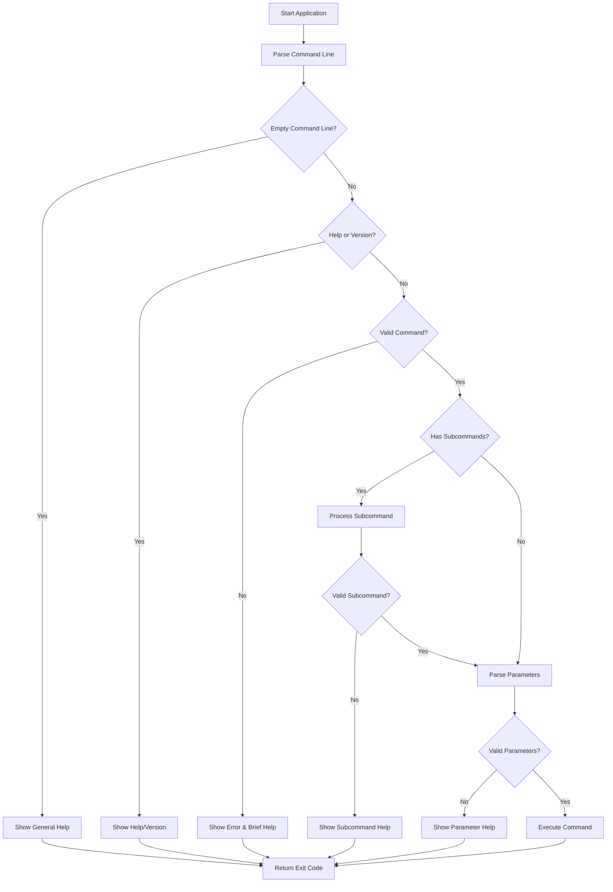
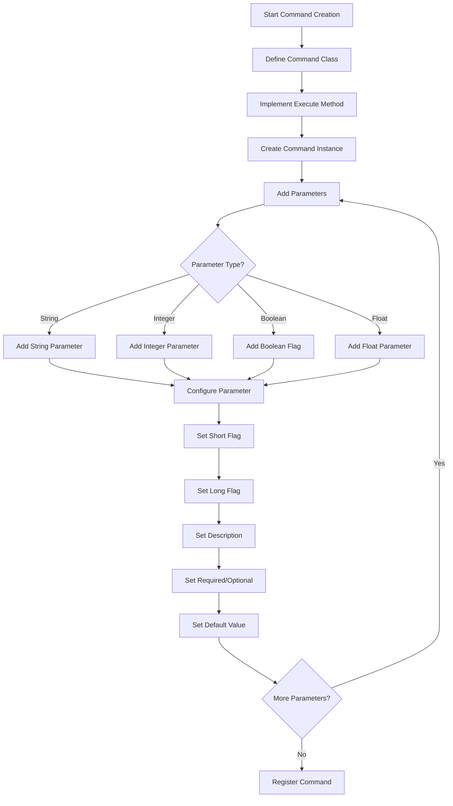

# CLI Framework User Manual

## Overview

The Free Pascal CLI Framework is a modern, feature-rich library for building command-line applications. It provides an intuitive way to create CLIs with commands, subcommands, parameters, and interactive progress indicators.

## Quick Reference Cheat Sheet

Essential commands for building CLI applications:

### Create Application
```pascal
// Create new CLI application
App := CreateCLIApplication('AppName', '1.0.0');
```

### Create Command
```pascal
// Create a command with name and description
Cmd := TBaseCommand.Create('command-name', 'Command description');
```

### Add Parameters
```pascal
// String parameter
Cmd.AddStringParameter('-n', '--name', 'Description', False, 'default');

// Integer parameter
Cmd.AddIntegerParameter('-c', '--count', 'Description', True);  // Required

// Float parameter
Cmd.AddFloatParameter('-r', '--rate', 'Description', False, '1.0');

// Boolean flag (presence means true)
Cmd.AddFlag('-v', '--verbose', 'Description');

// Boolean parameter (explicit true/false)
Cmd.AddBooleanParameter('-d', '--debug', 'Description', False, 'false');

// Path parameter
Cmd.AddPathParameter('-p', '--path', 'Description', False, GetCurrentDir);

// Enum parameter
Cmd.AddEnumParameter('-l', '--level', 'Description', 'debug|info|warn|error');

// DateTime parameter (format: YYYY-MM-DD HH:MM)
Cmd.AddDateTimeParameter('-d', '--date', 'Description');

// Array parameter (comma-separated values)
Cmd.AddArrayParameter('-t', '--tags', 'Description', False, 'tag1,tag2');

// Password parameter (masked in output)
Cmd.AddPasswordParameter('-k', '--key', 'Description', True);

// URL parameter (validates URL format)
Cmd.AddUrlParameter('-u', '--url', 'Description', True);
```

### Get Parameter Values
```pascal
var
  StrValue: string;
  IntValue: Integer;
  FloatValue: Double;
  BoolValue: Boolean;
begin
  // Returns True if parameter exists or has default value
  if GetParameterValue('--param-name', StrValue) then
    // Use StrValue...

  // Framework automatically converts to correct type
  GetParameterValue('--count', IntValue);
  GetParameterValue('--rate', FloatValue);
  GetParameterValue('--verbose', BoolValue);
end;
```

### Add Subcommands
```pascal
// Create main command
MainCmd := TBaseCommand.Create('git', 'Git operations');

// Create and add subcommand
SubCmd := TBaseCommand.Create('clone', 'Clone repository');
MainCmd.AddSubCommand(SubCmd);
```

### Register and Run
```pascal
// Register command
App.RegisterCommand(Cmd);

// Run application
ExitCode := App.Execute;
```

### Progress Indicators
```pascal
// Spinner (for unknown duration)
Spinner := CreateSpinner(ssDots);
Spinner.Start;
try
  // Work here...
finally
  Spinner.Stop;
end;

// Progress bar (for known steps)
Progress := CreateProgressBar(TotalSteps);
Progress.Start;
try
  for i := 1 to TotalSteps do
  begin
    // Work here...
    Progress.Update(i);
  end;
finally
  Progress.Stop;
end;
```

## Table of Contents

- [CLI Framework User Manual](#cli-framework-user-manual)
  - [Overview](#overview)
  - [Quick Reference Cheat Sheet](#quick-reference-cheat-sheet)
    - [Create Application](#create-application)
    - [Create Command](#create-command)
    - [Add Parameters](#add-parameters)
    - [Get Parameter Values](#get-parameter-values)
    - [Add Subcommands](#add-subcommands)
    - [Register and Run](#register-and-run)
    - [Progress Indicators](#progress-indicators)
  - [Table of Contents](#table-of-contents)
  - [Features](#features)
  - [Application Flow](#application-flow)
  - [Command Parameter Building Flow](#command-parameter-building-flow)
  - [Installation](#installation)
  - [Quick Start](#quick-start)
    - [1. Creating a Simple CLI Application](#1-creating-a-simple-cli-application)
    - [2. Creating a Git-like CLI](#2-creating-a-git-like-cli)
    - [3. Progress Indicators](#3-progress-indicators)
      - [Spinner Types](#spinner-types)
      - [Using Spinners](#using-spinners)
      - [Progress Bars](#progress-bars)
      - [Choosing Between Spinner and Progress Bar](#choosing-between-spinner-and-progress-bar)
  - [Parameter Types and Validation](#parameter-types-and-validation)
    - [Basic Types](#basic-types)
      - [String Parameters](#string-parameters)
      - [Integer Parameters](#integer-parameters)
      - [Float Parameters](#float-parameters)
      - [Boolean Parameters and Flags](#boolean-parameters-and-flags)
      - [Date and Time Parameters](#date-and-time-parameters)
      - [Enumerated Values](#enumerated-values)
      - [URL Parameters](#url-parameters)
      - [Array Parameters](#array-parameters)
      - [Password Parameters](#password-parameters)
    - [Parameter Validation](#parameter-validation)
    - [Basic Types](#basic-types-1)
    - [Complex Types](#complex-types)
    - [Error Messages](#error-messages)
    - [Required Parameters](#required-parameters)
    - [Default Values](#default-values)
    - [Getting Parameter Values](#getting-parameter-values)
    - [Best Practices](#best-practices)
  - [Command-Line Usage](#command-line-usage)
    - [Basic Command Structure](#basic-command-structure)
    - [Getting Help](#getting-help)
    - [Parameter Formats](#parameter-formats)
  - [Troubleshooting](#troubleshooting)
    - [Common Issues](#common-issues)
  - [Best Practices](#best-practices-1)
  - [Useful Unicode Characters for CLI Interfaces](#useful-unicode-characters-for-cli-interfaces)
  - [Getting Help](#getting-help-1)
  - [Summary](#summary)
  - [Cheat Sheet](#cheat-sheet)
    - [Create Application](#create-application-1)
    - [Create Command](#create-command-1)
    - [Add Parameters](#add-parameters-1)
    - [Get Parameter Values](#get-parameter-values-1)
    - [Add Subcommands](#add-subcommands-1)
    - [Register and Run](#register-and-run-1)
    - [Progress Indicators](#progress-indicators-1)
  - [Bash Completion](#bash-completion)
    - [Features of the Generated Script](#features-of-the-generated-script)
    - [How It Works](#how-it-works)
      - [Technical Rationale](#technical-rationale)
  - [PowerShell Tab Completion (v2025.06)](#powershell-tab-completion-v202506)
    - [Overview](#overview-1)
    - [How to Enable](#how-to-enable)
    - [Usage](#usage)
    - [Example](#example)
    - [Notes](#notes)


## Features

- Command and subcommand support
- Parameter handling with validation
- Progress indicators (spinner and progress bar)
- Colored console output
- Built-in help system
- Automatic usage examples generation

## Application Flow



## Command Parameter Building Flow



## Installation

1. Clone the repository:
   ```bash
   git clone https://github.com/your-repo/cli-fp.git
   ```

2. Add to your project:
   ```pascal
   uses
     CLI.Interfaces,
     CLI.Application,
     CLI.Command,
     CLI.Parameter,
     CLI.Progress,  // For progress indicators
     CLI.Console;   // For colored output
   ```

## Quick Start

### 1. Creating a Simple CLI Application

```pascal
program MyApp;

{$mode objfpc}{$H+}{$J-}

uses
  SysUtils,
  CLI.Interfaces,
  CLI.Application,
  CLI.Command,
  CLI.Parameter,
  CLI.Console;

type
  TGreetCommand = class(TBaseCommand)
  public
    function Execute: Integer; override;
  end;

function TGreetCommand.Execute: Integer;
var
  Name: string;
begin
  if GetParameterValue('--name', Name) then
    WriteColoredLn('Hello, ' + Name + '!')
  else
    WriteColoredLn('Hello, World!');
  Result := 0;
end;

var
  App: ICLIApplication;
  Cmd: TGreetCommand;
  ExitCode: Integer;
begin
  try
    App := CreateCLIApplication('MyApp', '1.0.0');
    
    Cmd := TGreetCommand.Create('greet', 'Greet a person');
    // Add a string parameter for the name. It's optional.
    // If not provided and no default is set here, 'Hello, World!' will be printed by the Execute logic.
    Cmd.AddStringParameter('-n', '--name', 'Name to greet', False);
    // The above is a shorthand for:
    // Cmd.AddParameter('-n', '--name', 'Name to greet', False, ptString, '');
    
    App.RegisterCommand(Cmd);
    ExitCode := App.Execute;
  except
    on E: Exception do
    begin
      WriteColoredLn('Error: ' + E.Message, ccRed);
      ExitCode := 1;
    end;
  end;
  Halt(ExitCode);
end.
```

### 2. Creating a Git-like CLI

```pascal
type
  TCloneCommand = class(TBaseCommand)
  public
    function Execute: Integer; override;
  end;

  TInitCommand = class(TBaseCommand)
  public
    function Execute: Integer; override;
  end;

function TCloneCommand.Execute: Integer;
var
  Url: string;
  Progress: IProgressIndicator;
begin
  if not GetParameterValue('--url', Url) then
  begin
    WriteColoredLn('Error: URL is required', ccRed);
    Exit(1);
  end;

  Progress := CreateSpinner(ssLine);
  Progress.Start;
  try
    WriteColoredLn('Cloning from ' + Url + '...', ccCyan);
    Sleep(2000); // Simulate work
    WriteColoredLn('Clone complete!', ccGreen);
    Result := 0;
  finally
    Progress.Stop;
  end;
end;

function TInitCommand.Execute: Integer;
var
  Path: string;
  Progress: IProgressIndicator;
begin
  if not GetParameterValue('--path', Path) then
    Path := GetCurrentDir;

  Progress := CreateSpinner(ssLine);
  Progress.Start;
  try
    WriteColoredLn('Initializing repository at ' + Path + '...', ccCyan);
    Sleep(1000); // Simulate work
    WriteColoredLn('Repository initialized!', ccGreen);
    Result := 0;
  finally
    Progress.Stop;
  end;
end;

var
  App: ICLIApplication;
  RepoCmd: TBaseCommand;
  CloneCmd: TCloneCommand;
  InitCmd: TInitCommand;
  ExitCode: Integer;
begin
  try
    App := CreateCLIApplication('MyGit', '1.0.0');
    
    RepoCmd := TBaseCommand.Create('repo', 'Repository management');
    
    CloneCmd := TCloneCommand.Create('clone', 'Clone a repository');
    // Add a required string parameter for the URL.
    CloneCmd.AddStringParameter('-u', '--url', 'Repository URL to clone', True);
    // The above is a shorthand for:
    // CloneCmd.AddParameter('-u', '--url', 'Repository URL to clone', True, ptString, '');
    RepoCmd.AddSubCommand(CloneCmd);
    
    InitCmd := TInitCommand.Create('init', 'Initialize a repository');
    // Add an optional path parameter, defaulting to the current directory.
    InitCmd.AddPathParameter('-p', '--path', 'Path to initialize repository', False, GetCurrentDir);
    // The above is a shorthand for:
    // InitCmd.AddParameter('-p', '--path', 'Path to initialize repository', False, ptPath, GetCurrentDir);
    RepoCmd.AddSubCommand(InitCmd);
    
    App.RegisterCommand(RepoCmd);
    
    ExitCode := App.Execute;
  except
    on E: Exception do
    begin
      WriteColoredLn('Error: ' + E.Message, ccRed);
      ExitCode := 1;
    end;
  end;
  Halt(ExitCode);
end;
```

### 3. Progress Indicators

The framework provides two types of progress indicators: spinners for indeterminate progress (when you don't know the total steps) and progress bars for determinate progress (when you know the total steps).

#### Spinner Types

The framework supports various spinner styles to match your application's needs:

1. **Dots (ssDots)** - Braille dots animation
   ```
   ⠋⠙⠹⠸⠼⠴⠦⠧⠇⠏
   ```
   Best for: Modern terminals with Unicode support
   ```pascal
   Spinner := CreateSpinner(ssDots);
   ```

2. **Line (ssLine)** - Simple ASCII line animation
   ```
   -\|/
   ```
   Best for: Legacy terminals or when Unicode isn't supported
   ```pascal
   Spinner := CreateSpinner(ssLine);  // Default style
   ```

3. **Circle (ssCircle)** - Unicode circle animation
   ```
   ◐◓◑◒
   ```
   Best for: Clean, minimalist look
   ```pascal
   Spinner := CreateSpinner(ssCircle);
   ```

4. **Square (ssSquare)** - Square rotation animation
   ```
   ◰◳◲◱
   ```
   Best for: Alternative to circle style
   ```pascal
   Spinner := CreateSpinner(ssSquare);
   ```

5. **Arrow (ssArrow)** - Arrow rotation animation
   ```
   ←↖↑↗→↘↓↙
   ```
   Best for: Directional indication
   ```pascal
   Spinner := CreateSpinner(ssArrow);
   ```

6. **Bounce (ssBounce)** - Bouncing dot animation
   ```
   ⠁⠂⠄⠂
   ```
   Best for: Subtle indication
   ```pascal
   Spinner := CreateSpinner(ssBounce);
   ```

7. **Bar (ssBar)** - Wave block animation
   ```
   ▏▎▍▌▋▊▉█▊▋▌▍▎▏
   ```
   Best for: Smooth, wave-like animation that flows left to right
   ```pascal
   Spinner := CreateSpinner(ssBar);
   ```
   The animation creates a fluid motion by:
   - Starting thin on the left (▏)
   - Growing progressively thicker (▎▍▌▋▊▉)
   - Reaching full block (█)
   - Smoothly reducing thickness (▊▋▌▍▎▏)
   This creates a natural wave-like effect that's easy on the eyes.

#### Using Spinners

Here's a complete example of using a spinner:

```pascal
procedure ProcessFiles(const Files: TStringList);
var
  Spinner: IProgressIndicator;
  i: Integer;
begin
  // Create a spinner with dots style
  Spinner := CreateSpinner(ssDots);
  
  // Start the spinner
  Spinner.Start;
  try
    WriteColoredLn('Processing files...', ccCyan);
    
    // Your processing loop
    for i := 0 to Files.Count - 1 do
    begin
      // Update spinner (will animate)
      Spinner.Update(0);  // The parameter is ignored for spinners
      
      // Do your work here
      ProcessFile(Files[i]);
      Sleep(100);  // Simulate work
    end;
    
    WriteColoredLn('Processing complete!', ccGreen);
  finally
    // Always stop the spinner in a finally block
    Spinner.Stop;
  end;
end;
```

Important notes for using spinners:
- Always use a try-finally block to ensure the spinner is stopped
- Call Update regularly to maintain animation
- Choose a style appropriate for your terminal's capabilities
- The Update parameter is ignored for spinners (used for interface compatibility)

#### Progress Bars

For operations where you know the total steps, use a progress bar:

```pascal
procedure CopyFiles(const Files: TStringList);
var
  Progress: IProgressIndicator;
  i: Integer;
begin
  // Create a progress bar (total steps, width in characters)
  Progress := CreateProgressBar(Files.Count, 20);
  
  // Start the progress bar
  Progress.Start;
  try
    WriteColoredLn('Copying files...', ccCyan);
    
    // Your processing loop
    for i := 0 to Files.Count - 1 do
    begin
      // Update progress (current step)
      Progress.Update(i + 1);
      
      // Do your work here
      CopyFile(Files[i], DestPath + ExtractFileName(Files[i]));
      Sleep(50);  // Simulate work
    end;
    
    WriteColoredLn('Copy complete!', ccGreen);
  finally
    // Always stop the progress bar in a finally block
    Progress.Stop;
  end;
end;
```

Progress bar features:
- Shows percentage complete
- Visual bar indicates progress
- Automatically updates only when percentage changes
- Width is customizable

#### Choosing Between Spinner and Progress Bar

Use a **Spinner** when:
- The operation has no measurable progress
- You can't determine the total steps
- The operation is relatively quick
- You want to show activity without specifics

Use a **Progress Bar** when:
- You know the total number of steps
- The operation has measurable progress
- You want to show specific completion percentage
- The user needs to know how much longer to wait

## Parameter Types and Validation

The framework provides a rich set of parameter types with built-in validation:

### Basic Types

#### String Parameters
```pascal
// Any text value
AddStringParameter('-n', '--name', 'Name parameter');
```

#### Integer Parameters
```pascal
// Must be a valid integer
AddIntegerParameter('-c', '--count', 'Count parameter', True);  // Required
```

#### Float Parameters
```pascal
// Must be a valid floating-point number
AddFloatParameter('-r', '--rate', 'Rate parameter');
```

#### Boolean Parameters and Flags
```pascal
// Flag: Presence indicates true, false by default
AddFlag('-v', '--verbose', 'Enable verbose mode');

// Boolean: Must be 'true' or 'false'
AddBooleanParameter('-d', '--debug', 'Debug mode', False, 'false');
```

> **Note:** Flags created with `AddFlag` are always `false` by default and only become `true` if present on the command line. If you set a default value of `'true'`, the flag will be `true` even if not present, which is not standard CLI behavior and not recommended unless you have a specific use case.

#### Date and Time Parameters
```pascal
// Must be in format "YYYY-MM-DD HH:MM" (24-hour format)
AddDateTimeParameter('-d', '--date', 'Date parameter');
```

#### Enumerated Values
```pascal
// Must match one of the pipe-separated values
AddEnumParameter('-l', '--level', 'Log level', 'debug|info|warn|error');
```

#### URL Parameters
```pascal
// Must start with http://, https://, git://, or ssh://
AddUrlParameter('-u', '--url', 'Repository URL');
```

#### Array Parameters
```pascal
// Comma-separated values
AddArrayParameter('-t', '--tags', 'Tag list');
```

#### Password Parameters
```pascal
// Value is masked in help text and logs
AddPasswordParameter('-k', '--api-key', 'API Key');
```

### Parameter Validation

The framework validates all parameters before executing a command. Each parameter type has specific validation rules:

### Basic Types
- **String**: No validation
- **Integer**: Must be a valid integer number
- **Float**: Must be a valid floating-point number
- **Boolean**: Must be 'true' or 'false' (case-insensitive)

### Complex Types
- **DateTime**: Must be in format "YYYY-MM-DD HH:MM" (24-hour format)
- **Enum**: Must match one of the pipe-separated allowed values
- **URL**: Must start with http://, https://, git://, or ssh://
- **Array**: No validation on individual items
- **Password**: No validation, but value is masked in output

### Error Messages

The framework provides clear error messages when validation fails:

```
Error: Parameter "--count" must be an integer
Error: Parameter "--rate" must be a float
Error: Parameter "--debug" must be "true" or "false"
Error: Parameter "--date" must be in format YYYY-MM-DD HH:MM
Error: Parameter "--url" must be a valid URL starting with http://, https://, git://, or ssh://
Error: Parameter "--level" must be one of: debug|info|warn|error
```

### Required Parameters

Parameters can be marked as required:
```pascal
// Required parameter
AddIntegerParameter('-c', '--count', 'Count parameter', True);

// Optional parameter with default
AddStringParameter('-n', '--name', 'Name parameter', False, 'default');
```

If a required parameter is missing, the command will not execute and an error message will be displayed:
```
Error: Required parameter "--count" not provided
```

### Default Values

Optional parameters can have default values:
```pascal
// String with default
AddStringParameter('-n', '--name', 'Name parameter', False, 'World');

// Float with default
AddFloatParameter('-r', '--rate', 'Rate parameter', False, '1.0');

// Enum with default
AddEnumParameter('-l', '--level', 'Log level', 'debug|info|warn|error', False, 'info');
```

The default value will be used when:
- The parameter is not provided on the command line
- The parameter is optional (Required = False)
- A default value is specified

### Getting Parameter Values

To retrieve parameter values in your command's Execute method:

```pascal
function TMyCommand.Execute: Integer;
var
  Name: string;
  Count: Integer;
  Rate: Double;
  Level: string;
begin
  // Get parameter values with error checking
  if GetParameterValue('--name', Name) then
    WriteLn('Name: ', Name);
    
  if GetParameterValue('--count', Count) then
    WriteLn('Count: ', Count);
    
  if GetParameterValue('--rate', Rate) then
    WriteLn('Rate: ', Rate:0:2);
    
  if GetParameterValue('--level', Level) then
    WriteLn('Level: ', Level);
    
  Result := 0;
end;
```

### Best Practices

1. **Always Check Return Value**: The `GetParameterValue` function returns `False` if the parameter wasn't provided and has no default value.

2. **Use Strong Typing**: The framework will automatically convert parameter values to the correct type:
   ```pascal
   var
     Count: Integer;
     Rate: Double;
     IsEnabled: Boolean;
   ```

3. **Provide Clear Descriptions**: Parameter descriptions appear in help text:
   ```pascal
   AddStringParameter('-n', '--name', 'Your name (required for personalized greeting)');
   ```

4. **Use Appropriate Types**: Choose the most appropriate parameter type:
   - Use `AddFlag` for simple on/off features
   - Use `AddBooleanParameter` for explicit true/false values
   - Use `AddEnumParameter` for fixed sets of values
   - Use `AddPasswordParameter` for sensitive data

## Command-Line Usage

### Basic Command Structure

```bash
myapp <command> [options]
```

### Getting Help

- Show general help: `myapp -h` or `myapp --help`
- Show detailed reference: `myapp --help-complete`
- Show command help: `myapp <command> --help`

### Parameter Formats

The framework supports various parameter formats:
- Long format: `--param=value` or `--param value`
- Short format: `-p value`
- Boolean flags: `--flag` or `-f` (false by default, true when present)

Example:
```bash
myapp test --flag        # --flag is true
myapp test               # --flag is false
```

## Troubleshooting

### Common Issues

1. **Command Not Found**
   - Verify command name spelling
   - Check if command is properly registered with `App.RegisterCommand`
   - Enable debug mode:
     ```pascal
     (App as TCLIApplication).DebugMode := True;
     ```

2. **Parameter Errors**
   - Check parameter format:
     ```bash
     --param=value    # Equals syntax
     --param value    # Space syntax
     -p value        # Short format
     ```
   - Verify required parameters are provided
   - Check parameter type matches expected value
   - Use `GetParameterValue` correctly:
     ```pascal
     var
       Value: string;
     begin
       if GetParameterValue('--param', Value) then
         // Parameter was provided
       else
         // Parameter was not provided
     end;
     ```

3. **Console Colors Not Working**
   - Windows: Check if ANSI support is enabled
   - Unix/Linux: Verify terminal supports colors
   - Always reset colors:
     ```pascal
     TConsole.SetForegroundColor(ccRed);
     try
       // Your colored output
     finally
       TConsole.ResetColors;
     end;
     ```

## Best Practices

1. **Command Organization**
   - Group related functionality into commands
   - Use subcommands for complex features
   - Keep command names clear and consistent
   - Follow naming conventions

2. **User Experience**
   - Provide helpful descriptions
   - Include examples in help text
   - Use progress indicators for long operations
   - Provide feedback for all operations

3. **Error Handling**
   - Display clear error messages using appropriate colors
   - Use appropriate exit codes
   - Validate user input
   - Always handle exceptions

4. **Color Usage**
   - Use red for errors
   - Use yellow for warnings
   - Use green for success messages
   - Use cyan for information
   - Use white for normal output

5. **Progress Indication**
   - Use spinners for indeterminate progress
   - Use progress bars for determinate progress
   - Always stop indicators in a finally block
   - Provide status messages with progress

## Useful Unicode Characters for CLI Interfaces

```
// Status indicators
'✓' // Success/Done
'✘' // Error/Failed
'⚠' // Warning
'ℹ' // Info
'❯' // Current item/Selection
'►' // Action/Process
'•' // Bullet point
'○' // Empty bullet
'●' // Filled bullet

// Progress/Loading
'⠋⠙⠹⠸⠼⠴⠦⠧⠇⠏' // Braille dots animation
'◐◓◑◒' // Circle animation
'▏▎▍▌▋▊▉█' // Progress bar blocks

// Borders/Boxes
'╔═╗' // Top border
'║ ║' // Side borders
'╚═╝' // Bottom border
```


## Getting Help

- Use `--help-complete` for comprehensive documentation
- Check command-specific help with `<command> --help`
- Enable debug mode for troubleshooting
- Refer to the technical documentation for development details

## Summary

This manual has walked you through building and extending CLI applications using the Free Pascal CLI Framework. By following these guidelines and best practices, you can create robust and user-friendly command-line tools.
Happy Coding!

## Cheat Sheet

Essential commands for building CLI applications:

### Create Application
```pascal
// Create new CLI application
App := CreateCLIApplication('AppName', '1.0.0');
```

### Create Command
```pascal
// Create a command with name and description
Cmd := TBaseCommand.Create('command-name', 'Command description');
```

### Add Parameters
```pascal
// String parameter
Cmd.AddStringParameter('-n', '--name', 'Description', False, 'default');

// Integer parameter
Cmd.AddIntegerParameter('-c', '--count', 'Description', True);  // Required

// Float parameter
Cmd.AddFloatParameter('-r', '--rate', 'Description', False, '1.0');

// Boolean flag (presence means true)
Cmd.AddFlag('-v', '--verbose', 'Description');

// Boolean parameter (explicit true/false)
Cmd.AddBooleanParameter('-d', '--debug', 'Description', False, 'false');

// Path parameter
Cmd.AddPathParameter('-p', '--path', 'Description', False, GetCurrentDir);

// Enum parameter
Cmd.AddEnumParameter('-l', '--level', 'Description', 'debug|info|warn|error');

// DateTime parameter (format: YYYY-MM-DD HH:MM)
Cmd.AddDateTimeParameter('-d', '--date', 'Description');

// Array parameter (comma-separated values)
Cmd.AddArrayParameter('-t', '--tags', 'Description', False, 'tag1,tag2');

// Password parameter (masked in output)
Cmd.AddPasswordParameter('-k', '--key', 'Description', True);

// URL parameter (validates URL format)
Cmd.AddUrlParameter('-u', '--url', 'Description', True);
```

### Get Parameter Values
```pascal
var
  StrValue: string;
  IntValue: Integer;
  FloatValue: Double;
  BoolValue: Boolean;
begin
  // Returns True if parameter exists or has default value
  if GetParameterValue('--param-name', StrValue) then
    // Use StrValue...

  // Framework automatically converts to correct type
  GetParameterValue('--count', IntValue);
  GetParameterValue('--rate', FloatValue);
  GetParameterValue('--verbose', BoolValue);
end;
```

### Add Subcommands
```pascal
// Create main command
MainCmd := TBaseCommand.Create('git', 'Git operations');

// Create and add subcommand
SubCmd := TBaseCommand.Create('clone', 'Clone repository');
MainCmd.AddSubCommand(SubCmd);
```

### Register and Run
```pascal
// Register command
App.RegisterCommand(Cmd);

// Run application
ExitCode := App.Execute;
```

### Progress Indicators
```pascal
// Spinner (for unknown duration)
Spinner := CreateSpinner(ssDots);
Spinner.Start;
try
  // Work here...
finally
  Spinner.Stop;
end;

// Progress bar (for known steps)
Progress := CreateProgressBar(TotalSteps);
Progress.Start;
try
  for i := 1 to TotalSteps do
  begin
    // Work here...
    Progress.Update(i);
  end;
finally
  Progress.Stop;
end;
```

## Bash Completion

The CLI framework provides an advanced Bash completion system. You can generate a completion script using the `--completion-file` global flag:

```bash
./yourcli --completion-file > myapp-completion.sh
```

**Safe Usage:**
- Do NOT write the completion script directly to your `.bashrc` or `.bash_profile`.
- Instead, source the generated script from your shell config:

```bash
echo 'source $(pwd)/myapp-completion.sh' >> ~/.bashrc
```

> The CLI can only warn you if you pass `.bashrc` (or similar) as a direct argument. If you use shell redirection (`> ~/.bashrc`), the CLI cannot detect this, so please follow the safe usage instructions above.

### Features of the Generated Script

- Tab-completion for all commands, subcommands, and parameters
- **Context-aware:** Only valid subcommands and parameters for the current command path are suggested
- **Global flags:**
  - At the root level, completions include all global flags (`--help`, `-h`, `--help-complete`, `--version`, `--completion-file`).
  - At all subcommand levels, only `-h` and `--help` are offered as global flags (matching the CLI's actual behavior).
- **Automatic value completion:** Boolean parameters automatically complete with `true`/`false`, and enum parameters complete with their allowed values.
- Stays up-to-date with your CLI's structure
- No external dependencies required

### How It Works

- The script uses a Bash associative array to represent the full command/subcommand/parameter tree.
- Completions are context-sensitive: only valid subcommands and parameters for the current path are suggested.
- Global flags are only included where they are actually accepted by the CLI.

**Example:**
If your CLI has a structure like:
```
mycli repo clone --url ...
mycli repo init --path ...
mycli repo remote add ...
```
Then, after typing `mycli repo` and pressing Tab, you will see only valid subcommands and `-h`/`--help`. Only at the root will you see all global flags. After `mycli repo clone -`, you will see only valid parameters for `clone` plus `-h`/`--help`.

> This matches the behavior of popular tools like `git` and `docker`, and ensures a user-friendly and robust completion experience.

#### Technical Rationale

- The completion script generator outputs a Bash associative array for the command tree.
- The root node includes all global flags; subcommands only include help flags.
- This ensures completions are always valid and never suggest flags that would be rejected by the CLI parser.
- The approach is robust, user-friendly, and matches modern CLI conventions.


## PowerShell Tab Completion (v2025.06)

### Overview
The CLI now provides robust, context-aware PowerShell tab completion for all commands, subcommands, and flags. This matches the experience of modern CLI tools (e.g., Go's Cobra, git, etc.).

### How to Enable
1. Generate the completion script:
   ```powershell
   ./YourApp.exe --completion-file-pwsh > myapp-completion.ps1
   ```
2. Load it in your PowerShell session:
   ```powershell
   . ./myapp-completion.ps1
   ```
3. (Optional) Add the above line to your `$PROFILE` for automatic loading.

### Usage
- After typing the executable and a space, press Tab to see all subcommands and global flags (not files).
- After typing a subcommand and a space, press Tab to see sub-subcommands and flags for that subcommand.
- Completion is context-aware at every level.
- **Automatic value completion:** Boolean parameters automatically complete with `true`/`false`, and enum parameters complete with their allowed values.
- If there are no further subcommands, only flags are shown.
- If nothing matches, file completion is suppressed.

### Example
```
PS> ./SubCommandDemo.exe <Tab>
  foo      bar      --help   --version
PS> ./SubCommandDemo.exe foo <Tab>
  sub1     sub2     --flag1  --help
```

### Notes
- Works in PowerShell 7.5+ (tested)
- The completion script is dynamically generated from the CLI command tree.
- Bash completion is also supported (see README).